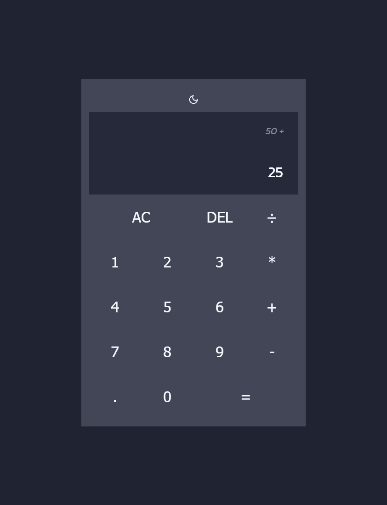
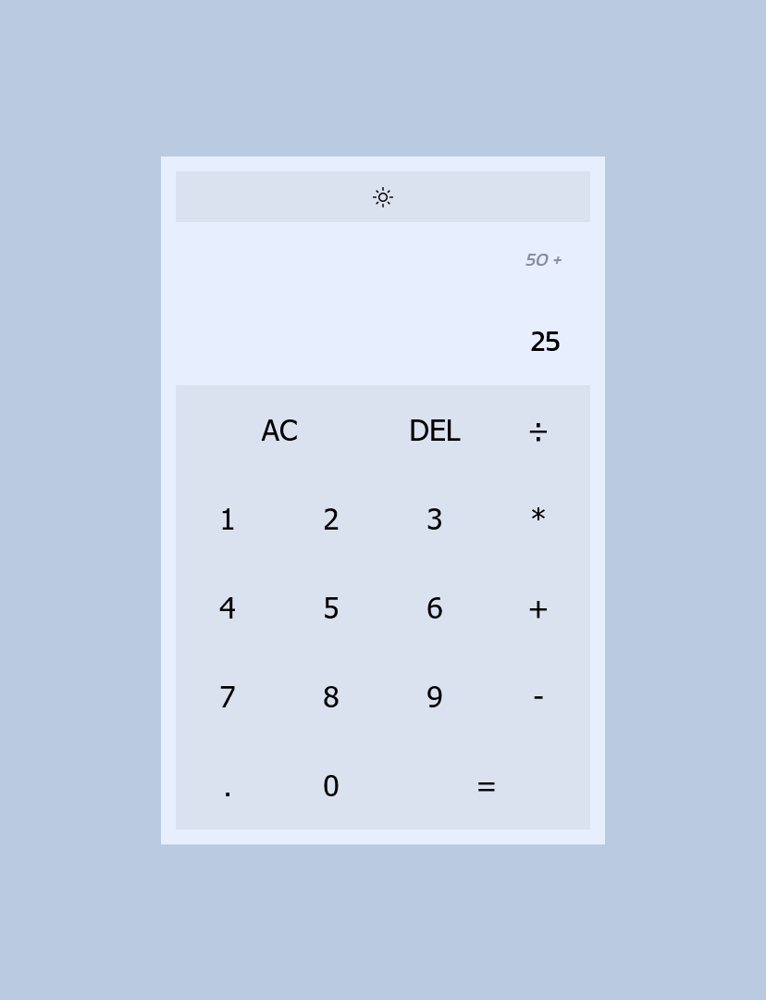

# Progetto - JavaScript Calculator

## Descrizione

Lo scopo del progetto è quello di creare una calcolatrice in grado di svolgere calcoli elementari. Questa deve mostrare a schermo le cifre propriamente formattate relative a ogni azione compiuta sulla tastiera e riportare l'eventuale risultato nel display. 

La calcolatrice è stata costruita in modo da permettere di effettuare calcoli che partono da numeri in negativo.
 
È stato inoltre inserito un bottone che permette di passare dalla light mode alla dark mode e viceversa senza resettare i calcoli presenti sullo schermo al momento della transizione.

## Screenshots

## Costruito con:

- HTML
- CSS
- JavaScript Vanilla

## Link

[Versione live del progetto](https://paciott.github.io/JS-Calculator/)